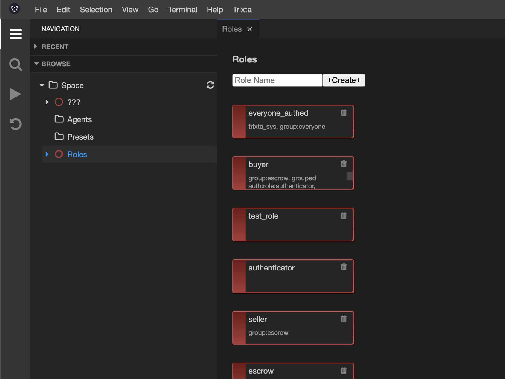

# Roles

## Understanding what a Role is

In Trixta, a Role is a logical grouping of Interactions that an Agent can more easily make sense of and assume the function of.

If you can imagine a Space that has 100 different ways of Interacting with it, it stands to reason that dividing that up into 10 Roles (each with 10 Interactions), would make a Role 10 times easier to understand and act on from the perspective of an Agent. Of course we wouldn’t just arbitrarily divide Interactions up like this, we would group them logically in a way that was appropriate for the Product or Organisation you are operating in.

:::info Role

the function assumed or part played by a person or thing in a particular situation.

:::

And remember, because we explicitly allocate an Agent one or more Roles, that implies we deny them the ability to perform the other Roles. More often than not, the reasoning on where to draw the borders between Roles is around who or what should *not* have access to certain Interactions.

The purpose of a Role is to simplify and divide up the responsibilities in your Space.

## Role view

Using Navigation → Browse, look for Roles underneath Space.

Selecting this will open up the Roles view which will list all the Roles you’ve added to your Space as well as provide options to Create new, Edit or Remove them.

## Create new Role

To create a new Role, enter a Name into the input box and hit Create.

Confirm the dialog:

Your new Role should appear in the View:

:::tip

Be sure to scroll down if you cannot see your new Role, initially it may be added to the bottom before later getting arranged alphabetically.

:::

## Remove a Role

Remove a Role by clicking the trash can icon at the top right of the block.

## Edit a Role

To Edit a Role, click on it in the view and the Role Settings panel should appear. Here you can change the Name, Description, Tags, and set whether the Role is `unrestricted` or not. An unrestricted Role would mean that all Agents, regardless of their Role allocation, can assume the Role.

:::tip

Role settings are getting an upgrade, until then we have used tags to add experimental settings to roles which will become part of the form in future

:::

Here is a complete list of tags that serve a function when added to a Role:

- `group:###` - [Viewing individual Roles](#viewing-individual-roles)
- `grouped` - [Role Grouping](#role-grouping)
- `auth:role:###` - [Role Authorization](#role-authorization)
- `auth:type:role_reaction` - [Role Authorization](#role-authorization)
- `auth:reaction:###` - [Role Authorization](#role-authorization)

## Default Roles

Spaces by default have a few Roles already baked in. The ones to take note of are:

- `everyone_anon` - this Role is for all Agents, and it is unrestricted, meaning that any Agent logged in or not can assume this Role and perform the Interactions on it. Good for general anonymous Interactions.
- `everyone_authed` - this Role is for all Agents but only those who have logged in. Good for general Interactions where you at the very least know the identity of the Agent.
- `trixta_ide_user` - consider that the Trixta IDE runs on Trixta itself, this is the Role used to perform the Interactions needed to work with the IDE in general. You would reserve this Role for Agents you would like to join in on the design and creation of the space.

## Viewing individual Roles

Earlier we viewed all Roles together in one view. There also exists a view for looking at a single Role in detail. We will go into this in more detail in the section around Interactions, but for now know that this is accessible when clicking on a specific Role in the browse or search results.

In the Browse tree structure, you may notice the `group:###` tags taking effect. In the screenshot, the Roles: Buyer, Escrow and Seller all have a tag that reads `group:escrow` added to them. This groups them in the tree to help you focus on associated Roles.

## Role Authorization

In order for an Agent to assume a Role, they must first pass the Space’s Authorization tests. We first need to trust that the Agent owns their Identity - we do that by asking for a password or token or make use of some other 3rd party Authentication mechanisms (like Google’s).

Once we trust that the Agent is who they say they are, we then test whether they have access to the Role in question. By default Trixta will store who has access to what and will handle this automatically. However, should you wish to customise what happens you can use the following tag options to indicate that you want a particular Role to have its own means of Authroization:

- `auth:role:###` - where ### would be the name of the Role to use.
- `auth:type:role_reaction` - means, delegate this to a Reaction on a role.
- `auth:reaction:###` - where ### would be the name of the Reaction on the Role.

:::tip

Before this section makes any sense, you’ll need to learn about Interactions which are coming up. These are also a lot easier to understand in the context of an example or two, once you are more familiar with Trixta in general.

:::
## Role Grouping

This is extremely useful when you have a situation where you want to use the same Role design but have more than one potential grouping of them, in which an Agent should have access to one, but not necessarily the other.

For e.g. you may have a Doctor Role, but you would like them to be grouped by specific Hospitals. With a group, you would easily be able to allocate a Doctor Role to a particular Agent if you also specified the appropriate Hospital. This would prevent an Agent from one Hospital participating as a Doctor in some other Hospital.

Note that an Agent could be allocated Role access to more than one group if we wanted, the main take away here is that we can gain finer control by using Role Grouping.

To enable this feature on a Role you would add the tag `grouped` to it. Now whenever an Agent tries to join a Role, they would also be required to specify which group.

:::tip

Currently it is required to add custom authorization to Roles that are Grouped. [Role Authorization](#role-authorization)

:::
## Role Cheatsheet

- The relationship between Roles and Agents is many-to-many.
- Each Role can have Interactions linked to it, these are exclusive to the Role they are linked to.

## Exercises

1. Create a new Role in the demo Space
2. Edit your new Role to be included in a new folder by using Tags to do so

## Videos

Coming soon…
