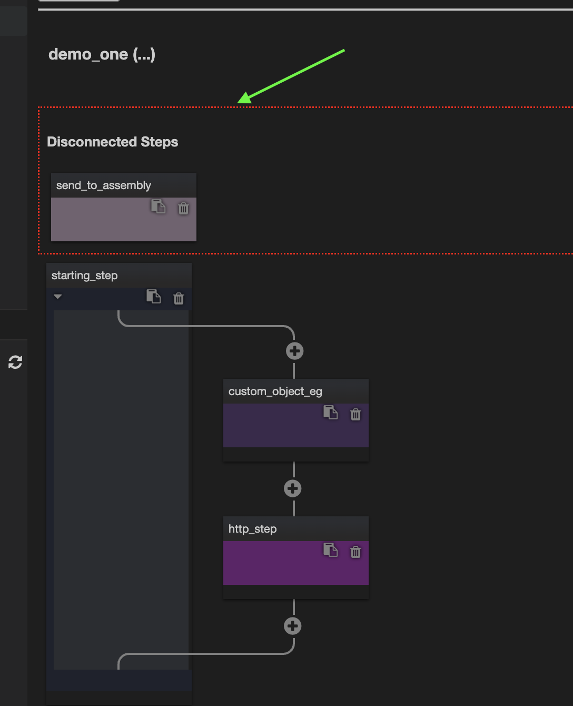

# Flows (Advanced)

<aside>
💡 Be sure to have first gone through [Flows (Basic)](../Flows%20(Basic)/index.md) before continuing here…

</aside>

## Running Flows and stopping them (process termination)

Coming soon…

## Disconnected steps

It is possible to disconnect steps, when this happens we will show them at the top of the flow for you to either re-arrange or delete.



<aside>
💡 These currently only show on reload of the Flow. In future we will have them show immediately or prevent the possibility completely.

</aside>

## Versioning

Versioning is essential for working in team and for safeguarding you from lost work. Currently we apply Versioning to Flows, in future we will apply it to all parts of Trixta. When a Flow is selected, use the Versioning panel by clicking on the indicated icon on the left.


The idea here is to not only save individual versions of your Flows, but to also save these to a remote location so that you and your team can access it again from elsewhere. This is especially useful if the local versions are lost somehow. This Versioning panel is broken down into 5 sub-sections, together they help you perform the necessary steps to version and save to a remote location.

### Config Wizard

This panel is used to help set the initial versioning settings for your Flow based on an already existing Preset (See [Presets](../../Presets/index.md)).

The following is an example of the shape of data needed for this preset. The values here are just examples, they would need to correctly correspond with values that would work when connecting to the remote.

```json
{
 "branch_name": "feature/develop",
 "file_path": "default/flow/<...>.ex",
 "host": "gitlab.com",
 "project_id": "12345678",
 "project_name": "project-abc",
 "source_type": "gitlab",
 "token": "abcdefghijklmnopqrst"
}
```

This is typically something that would be setup early on and would only need to be done once. With it in place, we can now use the Config Wizard, to apply the Preset and make minor adjustments (like an appropriate file_path) before saving the settings.


When clicking on the Config Wizard Submit button, the system will prompt for feedback. There will be a notification with a Reply button available bottom right. Click that to show the dialog.


View the dialog, make any adjustments and submit to save the settings accordingly. Typically you would only be changing the File Path to match the name of your flow instead of the <…> shown below.


<aside>
💡 This entire section is more work for you than we would like. Ideally all things in Trixta should have sensible defaults to automatically give you great versioning settings and then only if you would like to tweak them, to let you do so.

</aside>

### Settings

The Settings panel will display what is current set on the Flow you are viewing. You can adjust them here.


### Version Name

Providing a version with a name provides you with a point in time in which you can go back to. Set this whenever you reach a milestone or before saving to a remote location.


### Save to Git (Remote)

To save a version to a Git Remote, indicate which version and provide a comment. Clicking on submit will use the settings you provided earlier and save to the remote for you.


### Versions

The Versions panel will show you a list of all your versions for the selected Flow. Notice that the Source Type is sometimes `space` and sometimes `gitlab` - this just shows you whether the version is local to the space, or whether it was saved to the remote. Clicking on any of the versions will show a preview of the Flow at that time and also provide an option to overwrite your current version with the older version (useful if you have made a mistake and would like to backtrack).


## Overlays

Coming soon…

## Logging

Coming soon…

## Flow tags

Coming soon…
