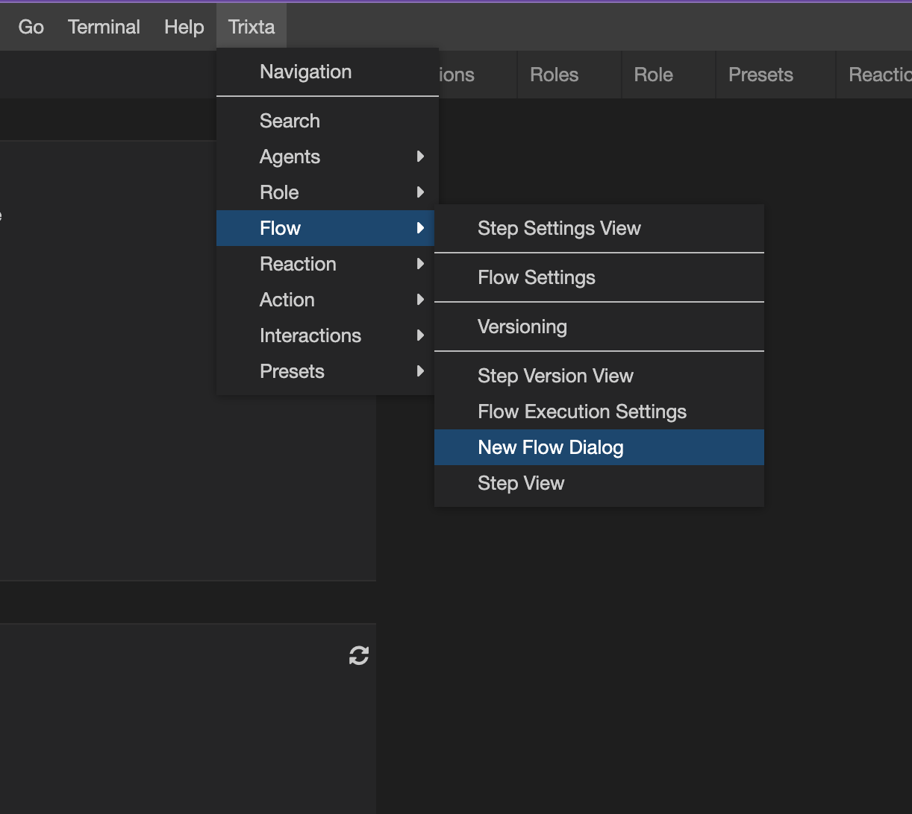

# Flows (Basic)

## Understanding what a Flow is

A Flow is an arrangement of Reactions (one of the two types of [Interactions](../../Interactions/index.md) ). If we were to use our orchestra metaphor, a Flow would be the composition, the planned piece of music with which the conductor will follow from start to finish directing all the members of the orchestra accordingly to produce the desired performance.

Just like a piece of music, it is not limited to one performance, in Trixta, Actions are linked to Flows, and each time an Action happens, a new “performance” of a Flow begins. We refer to this as an Instance of a Flow. This also means that it is entirely possible to have multiple instances of a Flow running concurrently (at the same time).

With Flows, one can get really creative in terms of solving problems, the way you compose your Flow may be different to how someone else might, and so a big focus of ours is to ensure anyone can visualise and make sense of any Flow quickly and easily through the IDE.

## Create a new Flow

In most cases a new Flow is automatically created whenever a new Action is created on a Role. This new Flow gets given a name that matches the Action. This automatic creation of a Flow does not happen if a Flow that has the same name as the new Action already exists, in this case the Flow is linked but otherwise left untouched.

There are situations in which you may want to create a Flow outside of creating an Action. To do so you can find the option to do so under the Trixta menu → Flow → New Flow Dialog

## Finding a Flow

To find a Flow, you have a few options:

### Browse

Using the Browse panel in the IDE, you can find Flows linked to Actions by expanding them.

<aside>
💡 In some Advanced cases a Flow can appear underneath a Reaction, more on that later.

</aside>

### Recent

The Space will keep track of the last 10 Flows you opened to help provide a convenient list with which you can use to get back to a Flow you are working on / with. This works across devices but remains specific to the account you used to login with.

### Space search

You can search for a Flow with the Space search panel. The search will return a view similar to that of the Browse and will provide the context of the Flow if one is found with the search term in its name.

### Note: what `???` is

You may have noticed something that appears as a Role with a label of `???`. This is a deliberate grouping of Flows that are not yet explicitly linked to a Role. Any Flow you create through the New Flow Dialog, or when Duplicating a Flow will appear under here until linked to an Action.

## Viewing a Flow

When a Flow is selected, it should appear in the middle panel, the following screenshot is what a new Flow will look like. What you will see, is a single block on the top left, we call this a Step.

The following is an example with more Steps in the Flow. Because we are focusing on Flows here and not Steps (which is part of another section), we are going to think of Steps here as generic things which share a few properties that help us arrange and compose them inside the Flow. Here we indicate the + button found on the lines between Steps. These indicate where you can add a new Step to the Flow.

### Step Inners

All Steps can either

- be a parent of other steps (we say it has an Inner section),
- or it does not, i.e. has no Inner.

Whether a Step has an Inner section or not depends on the type of Step. For the purposes of understanding Flows, it is good enough to know that these two scenarios exists.

The sequence in which Steps occur when an Instance of a Flow runs, depends on how the Steps with Inners work. In general you can assume that it follows the line that joins the Steps from top to bottom.

<aside>
💡 Although other views might offer something different, by default Trixta controls the layout of the Flow for you. By doing so, we provide extra meaning through positioning and it is also easier to pick up and ‘read’ a Flow designed by someone else. This frees you up to focus on the desired outcome rather than the Flow itself.

</aside>

The nesting that occurs by using Inners can also help you reduce information overload and help you focus on specific parts of the Flows.

<aside>
💡 Because Trixta is fundamentally functional, folding Steps up can also help you take increasingly broader / higher level views on the Flow. This is especially useful if you find a Flow is too complex at first, first fold the Flow up, get a handle on what is happening on the top most levels, then proceed to dial in the detail. Armed with an understanding of the context you can tackle smaller parts at a time. In cognitive psychology this is called chunking and helps with learning and comprehension.

</aside>

### Branches

By using Branches you can make your Flow more adaptive to what is going on at the time, typically something that is unknowable when designing.

The piece of music in an orchestra metaphor doesn’t map as well here because the music is fully composed from start to finish. At a stretch we can compare a conductor responding to a section in the orchestra playing too softly, to play louder. If that same section were too loud the next evening, the conductor would resort to instructing them to play quieter. The conductor is making a decision based on something happening at the time and potentially reacts differently each time the orchestra performs.

In Trixta, we typically Branch based on tags. All Steps output a tagged value when they complete. A tagged value is a value with a tag attached to it. This tag (or label) is used to summarize the outcome, where as the value itself could be quite complex.

Imagine for a moment you applied to attend a university. The response could include a variety of details like starting dates, costs, general notes, all these and more might be found inside the value, the tag on the other hand might be one of two: `accepted`, or `rejected`. This summarization is another form of chunking and Trixta makes it easy for you to see and Branch based on these tags.

<aside>
💡 It is possible to Branch on parts of the value too, however it is usually a sign that a Step could be improved or that the value is far too open ended or dynamic for us to assign a suitable tag other than say an “ok” or “error”. It would improve the Flow to attribute some general meaning to the data before proceeding.

</aside>

In the follow screenshot we can see some branches and associated tags. It is worthwhile noting that we can also collapse Branches.

There are a few special tags available that can be used to cover a few more situations which are a little more abstract and can be applied to any Step. They are:

- `__trixta_else` : A catch-all for any output tag that is not included in other Branches. Note: this will not catch errors or timeouts, use the following two instead.
- `__trixta_error` : For unexpected errors.
- `__trixta_timeout` : For a specific class of error that happens when we give up due to having to wait too long (usually based on a setting).

Even though we Branch, all Branches rejoin again eventually before continuing on from where it originally Branched. This is an important characteristic of Trixta and is different from other flow charts or workflow tools you would typically find today. The benefit of doing so, is it improves composability, it ensures that the system is always whole and working (never incomplete or broken), and always has multiple nested levels of context in which you can fold up or expand. It is functional from top to bottom and mimics programming best practises while providing a flow chart feeling.

The term Branching may invoke images of trees which appear to go from trunk to leaves and stop there, so it may be better to think of these Branches more like a circulatory system, starting at the heart which branch into smaller capillaries and then recombine again back towards the heart. A tree has a circulatory system so that analogy would still hold, it is just less intuitive to imagine the path from the leaves back towards the trunk.

<aside>
💡 Apart from music, a lot of our inspiration comes from observations in the natural sciences, we figure that the best examples of organization and systems that run well, are found in physics and biology.

</aside>

We will discuss how to create Branches in more detail when learning about Steps, for now the most important thing to takeaway is that they are available, they redirect the Flow accordingly and they recombine.

## Arranging Steps

Steps can be added and removed from the flow, they can also be copied or moved from one location to another in the same Flow or another Flow.

To do so, first click on the icon indicated in the screenshot, once done a notification should show that the step has been added to the clipboard

Now when you click on any of the + buttons on the lines in the Flow, you will have the option to Paste (creates a copy), or Move the step.

The support for this is still very basic and filled with quirks especially when moving a Step that has Steps inside its Inner section. In this case, currently, only the selected step will move, the Steps inside the Inner will become disconnected. The same quirk applies to deleting. Although Steps can be copied or moved from one Flow to another, it must be within the same browser tab, i.e. you cannot copy from one to another in a separate browser tab. In future versions we should be able to.

## Revisiting the purpose of a Flow

Now that you’ve had some exposure to Steps inside a Flow, let us revisit the opening sentence of this section and dive into what it is that we are trying to do here.

> A Flow is an arrangement of Reactions
>

If there is one Reaction, that could be considered the purpose of the flow. If there is more than one, then the purpose would be the sum of them all. With branches, things become conditional and complex, thankfully we have a Flow to visualize what is going on when that happens!

Although the opening sentence still holds, there are two more things to consider to get the full picture:

- When a Flow ends it will respond back to the Action that initiated it. Consider this also as part of the purpose. The diagram below separates this Action response and moves it to the right to better illustrate it.
- Supporting Steps (left out of the diagram above, but included below) help bridge the gap between Reactions, they can be further broken down into two major categories:
  - those that Transform (Translate) data between them or,
  - those that Orchestrate (Coordinate) the Flow so that Reactions occur
    - when you would like them to occur,
    - or under specific conditions.

<aside>
💡 Whew, this section got quite theoretical and may seem daunting, hang in there! It is because it is abstract here, with real world examples and a bit of practise it’ll become clear.

It is important to shed light on this abstract stuff first so that when looking at real world examples, we can refer you back to these patterns and you can start to see how this approach can be used over and over to solve all sorts of real world problems.

</aside>

## Delete, Rename or Duplicate Flows

Find the option to Delete, Rename or Duplicate Flows next to the Flow name at the top of the view. Clicking on it should reveal the three options. Clicking on each will show the appropriate controls

The Delete and Duplicate only have a Submit button. The Rename has an input to add your new name, once filled in, click Submit:

<aside>
💡 These options are quite new and do not yet have good feedback. It will appear as if nothing happened in all three cases. The recommendation is to navigate away and back again. When duplicating a flow, the duplicate will have the same name with a timestamp suffix to make it unique. The easiest means of finding it would be to use the search on the original name. Both the original and the new duplicate should show up.

</aside>

## Note about Save Flow

Changes are saved whenever a Step is saved. It is not necessary to use the Save Flow button. We included it as a work around to stop a flow (Re-saving it has the effect of stopping all running instances too). However this is currently bugged and will often show an error. We are in the process of fixing this.
