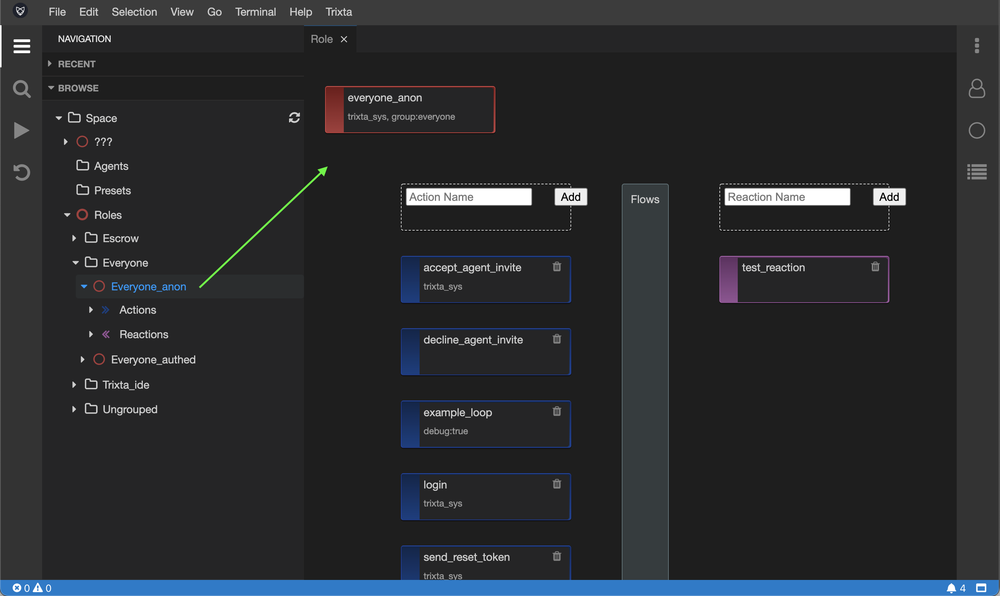

# Interactions

## Understanding what Interactions are

Interactions is the collective term for the two ways your Space interacts with the outside world, namely Actions and Reactions.

In order to understand the difference between the two, it is good to know that these Interactions always belong to a Role, and Roles are assumed by Agents, so really when we talk about Interactions, we can think of Agents interacting with your Space.

:::tip

If you haven’t learnt about Roles and Agents yet, don’t worry - just know that your Space interacts with the outside world via Agents who assume Roles to keep things simple.

:::

Agents interacting with your Space still sounds a bit cryptic, so to paint a clearer picture, let’s assume that in this case an Agent is an end-user, a person using a web browser. Even though Agents can be much more than that, it will be helpful to reduce it to this while we explore the topic.

:::info Interaction

communication or direct involvement with someone or something.

:::

So for now, when we talk about Interactions, let’s think of a Person interacting with your Space. With this as our example, let us discuss the main difference between Actions and Reactions. The biggest difference between Actions and Reactions is from where they originate:

- Actions originate from the Person,
  - Person sends an Action to the Space,
  - In other words, the Person requests the Space to act.
  - This is the start of a new process.

- Reactions originate from the Space,
  - The Space sends a Reaction to the Person,
  - In other words, the Space requests the Person to react.
  - This happens somewhere in the middle of a process started by some other Action.

:::tip

The term ‘process’ is used loosely above, here we have general business or organisation process or workflow that happens in your product or service in mind.

:::

Interactions provide a way for a Space to send and receive contextualized information.

## Role view for Interactions

To view the Interactions on a Role, first find and select it from the Navigation tree. Try this now with the `everyone_anon` Role. In the middle pane you will see an overview of the Role including a list of Actions (on the left, in blue), and Reactions (on the right, in purple)



Clicking on Actions underneath the Role in the Navigation tree, you will get a view that is only for Actions of this Role.


Similarly, clicking on the Reactions underneath the Role in the Navigation tree, you will get a view that is only for Reactions of this Role.


:::tip

For both Actions and Reactions, there is an even more focused view which can be found if selecting a single Interaction in the Navigation tree. This will show a view dedicated to just the item selected.

:::

## Actions

Recall that an Action is sent from the Person (more specifically an Agent) to the Space, it is a request for the Space to act in some way, usually by starting a new workflow or process.

The two most important attributes of an Action is its name and the shape of the data that gets sent.

### Adding an Action

To create a new Action, enter in a Name into the input box and hit Create.


Confirm the dialog if the name and the Role is as you intended:


Your new Action should now appear on the Role.

:::tip

Note that when creating a new Action, a new Flow of the same name is created and linked to it for your convenience. You may not yet know what a Flow is, it is just worthwhile noting that this happens automatically when creating a new Action.

:::


### Removing an Action

Remove an Action by clicking the trash can icon at the top right of the block.


### Edit an Action

To Edit an Action, click on it in the view and the Action Settings panel should appear.


**Actions settings:**

- Name,
- Description,
- Handler - this is what the Space will do when it receives this Action and is usually set to a Flow or None (if you want to disengage the Action for whatever reason),
- Tags, used to add extra information or to provide extra functionality

    :::tip

    Action settings are getting an upgrade, until then we have used tags to add experimental settings to Actions which will become part of the form in future

    :::

    Here is a complete list of tags that serve a function when added to an Action:

  - `debug:true` - adding this will cause this Action to run in debug mode, be sure to remove it when no longer debugging. (Note: this will move to the Flow in a future upgrade)
  - …


The following schema and settings work with <https://github.com/rjsf-team/react-jsonschema-form> (rjsf). The schema follow the [Json Schema](https://json-schema.org/) standard. We use this schema to describe various data shapes in Trixta.

:::tip

Reading the documentation for rjsf will help with understanding how best to work with this: [https://react-jsonschema-form.readthedocs.io/en/latest/](https://react-jsonschema-form.readthedocs.io/en/latest/)

The playground is useful to getting a quick idea on how it works: [https://rjsf-team.github.io/react-jsonschema-form/](https://rjsf-team.github.io/react-jsonschema-form/)

:::

**Request schema**

The request schema is used to define the shape of the data that the request, i.e the data getting sent from the Agent to the Space should look like.This helps the Space validate incoming requests by ensuring it complies with the schema. It also helps document the Action, leaving it easier for others to understand. Leaving a schema blank means that anything is valid.

Defining the parts of the data with names and their types is the most important thing to do. Next would be to list which are required (implying those that are not are optional). Json Schema can handle a lot of complex situation, like when some parts of the schema are dependent on others, this will make more sense in light of an example or two.

**Request settings**

The request settings have less to do with describing the data shape, but rather, it provides instructions on how to best display it as a form when there is a UI involved. This has a slightly different name in rjsf, it is called uiSchema. Generally ours works in the exact same way, where in some cases we have extended it a bit further to do things beyond what rsfj envisioned, such as using it to generate non-form UI.

To get a basic idea, with the request settings you can do things like set the order of the fields, override default controls with custom ones, etc.

Here is a useful link to get familiar with the kinds of things one can do: [https://react-jsonschema-form.readthedocs.io/en/latest/api-reference/uiSchema/](https://react-jsonschema-form.readthedocs.io/en/latest/api-reference/uiSchema/)

There are reserved Trixta ```ui:options``` to change the mode of how [trixta-js-core](https://trixtateam.gitbook.io/trixta-js-core/) responds to incoming requests. By default if not specified, the mode is in ```replace``` mode, which means that only 1 request will be kept at a time, and each following request will replace the next one. If you wish to change this default behaviour to stack the requests you can set this mode with the following ```ui:options```

```JSON
{
  "ui:options": { 
    "mode": {
      "type": "accumulate",
      "limit": 10
    } 
  }
}
```

OR 

```JSON
{
  "ui:options": { 
    "mode": {
      "type": "replace"
    } 
  }
}
```

**Response schema**

The response schema uses the same syntax as the request schema, but instead is used for the reply back to the Person from the Space. This is an underdeveloped area of Trixta in that even if you were to set this, it would not have any noticeable effect other than improving documentation. At a later stage it will become more useful.

## Reactions

### Adding a Reaction

To create a new Reaction, enter in a Name into the input box and hit Create.


Confirm the dialog if the name and the Role is as you intended:


Your new Reaction should now appear on the Role.

### Removing a Reaction

Remove a Reaction by clicking the trash can icon at the top right of the block.


### Edit a Reaction

To Edit a Reaction, click on it in the view and the Reaction Settings panel should appear.


Rea**ctions settings:**

- ~~Name,~~
- Description,
- Tags, used to add extra information or to provide extra functionality

    :::tip
    Reaction settings are getting an upgrade, until then we have used tags to add experimental settings to Reactions which will become part of the form in future

    :::

    Here is a complete list of tags that serve a function when added to an Reaction:

  - `debug:true` - adding this will cause this Reaction to run in debug mode, be sure to remove it when no longer debugging.
  - `send:###` - [Send tags (Advanced)](#send-tags-advanced)


:::caution

Beware, we discuss the settings below first the schema then the settings, in the UI above these two are in the opposite order and does not match the ordering of the Actions panel either. We will fix this, but until then pay attention to the name of the setting to know which is which.

:::

These work in the same way as the Action request schema and settings. Please refer back to that section for details:

[The following schema and settings work with <https://github.com/rjsf-team/react-jsonschema-form> (rjsf). The schema follow the [Json Schema](https://json-schema.org/) standard. We use this schema to describe various data shapes in Trixta.](#actions)

### Implications of Reactions that do not request data

In Trixta it is possible, even encouraged, to have Reactions whose request schemas are either null (nothing), or has an object in which each property’s data type is null (nothing). The implication here is that the Space is not requesting any information back. We say that this is **for Effect** (as opposed to the alternative: **for Response**).

For e.g. receiving a push notification to say that your delivery is on its way, would be an example of a Request for Effect. The provider isn’t asking you to reply back to them as such, however they do want to have an Effect on you, they want you to now know that your delivery is on the way. You received information and that is the end of that specific Interaction.

:::tip

We plan to have this characteristic of a Reaction, whether a Request for Effect or Request for Response, more clearly indicated in future - in turns out it is really useful for everyone involved to quickly and easily recognise which the designer of the Reaction intended.

:::

## Interactions view

The Interactions view is makes use of the schemas and settings of your Actions and Reactions to provide a sort of automatically generated UI. This UI is very useful when building in that you can test and prototype your work without waiting for an UI to be built as such. It is also a great learning tool to help you interact with your Space. It also comes in handy for when a team is unsure where a bug lies, this can quickly help determine whether an issue is in a custom interface or within the work done in Trixta.

To show the Interactions view, first select it from the Trixta menu → Interactions → Interactions.


When shown the Interactions view looks something like this:


The idea here is that you can look at how what you have built feels like for an Agent fulfilling a particular Role, or how perhaps two Roles might experience things as they interact with each other via the Space. Either way it is important to first select one or more Roles in the Roles dropdown before you will see any applicable Actions and Reactions below.

:::tip

One can use Grouped Roles in this view. To do so, instead of selecting your Role from the dropdown, rather type it in, using the group syntax: `role[group]`, i.e. the name of your role, open square bracket, then the group, close square bracket.

:::


You can further filter the Actions and Reaction by name, or tag by using a common separated list in the Filter box. The Show only action reactions checkbox is useful to hide all reactions that have no data, i.e. only show those that have been send to the Agent.

:::tip

Tip, you can open up multiple IDE tabs in your browser and connect to different roles in each to get a better feeling for how your software works between Roles. Having them in separate tabs helps reduce the clutter

:::

This screen is very new, we have a lot planned for it - the idea is for it to improve productivity and understanding for both you and your team.

## Interactions in depth

Coming soon…

- Theory: About Assumed Goal and Delegation
- Theory: Inverted CQRS. For Effect, For Response

## Send tags (Advanced)

Coming soon…

## Interactions Cheatsheet


- Role have zero, one or many Actions or Reactions.
- Interactions connect Roles to Flows.

## Exercises

1. Create a new Action on the `everyone_authed` Role.
2. After practicing in the rjsf playground, set the schema (with at least five fields) of your new Action and view it in Interactions view.
3. Change the order of the properties in your new Action using the request settings and see that this worked in the Interactions view.
4. Create a Reaction on the `everyone_authed` Role.

## Videos

Coming soon…
