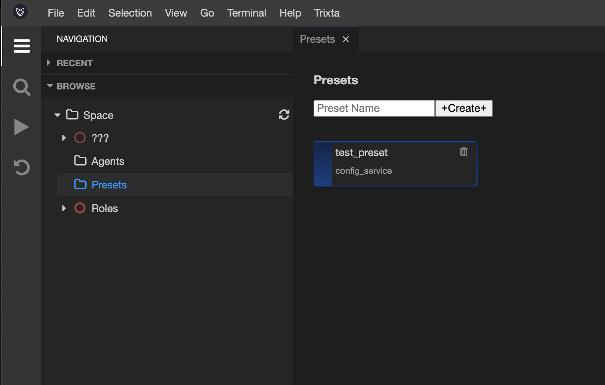

# Presets

## Understanding what a Preset is

Trixta is quick to build while maintaining a high level of quality thanks to the high degree of modularity, repetition of good patterns and excellent starting points. 

Presets play into this in that they are starting points for anything that has settings. They are pre-defined settings. Presets help others learn, improves productivity and keeps your Space flexible.

:::info Preset

a setting on a device that is adjusted or applied before use

:::

There is no doubt that new patterns and modules will emerge from the community, and for those who pioneer them, they won’t have many presets to guide them, but they are sure to leave some presets behind to help all that follow. This is one of the reasons learning about Presets can be found in all of the three onboarding styles - they help port over expertise to those who are beginners, so those who are strong in one area can assist those in another and vice versa through sharing useful Presets.

:::tip

Presets are still in their most basic form in the IDE currently. There is work to be done around saving and setting presets for entire steps or a wide range of other Trixta parts. At this time we you can save presets and refer to them within individual settings in steps.

:::

## Preset view

Using Navigation → Browse, look for Presets underneath Space. 

Selecting this will open up the Presets view which will list all the Presets you’ve added to your Space as well as provide options to Create new, Edit or Remove them.

## Create new Preset

To create a new Preset, enter in a Name into the input box and hit Create.

Confirm the dialog if the name is as you intended:

Your new Preset should appear in the View:

## Remove a Preset

Remove a Preset by clicking the trash can icon at the top right of the block.

## Edit a Preset

To Edit a Preset, click on it in the view and the Preset Settings panel should appear. 

:::tip

At this time we only have a preset type: `config_service`. This is the most basic type which is just a JSON object. We will take greater advantage of Presets in future versions of the IDE.

:::

## Presets to keep things flexible

Apart from providing sensible starting points, presets can also help act as pointers to settings that you want to keep flexible and controllable from one place. Imagine for example you have some sort of url (address) that is used in many places. Instead of repeating that over and over (and then having to update everywhere if it changes) you could maintain the link to a Preset and change all instances from one place. This is also very useful in multi-environment setups, that is if you have a testing environment that is separate from a live environment. That url we referred to for example may be different in each, and if so, Presets would help keep things orderly.

## Preset Cheatsheet

A, B and C above are all examples of abstract things in the Space. We don’t specify what here because we want to show that Presets are potentially applied to anything in a Space.

Although abstract here, each thing still is of some sort of Type. In this diagram A is Type X, and B, C are Type Y. We show this to communicate that Preset A is specifically designed to apply to Type X. That is, it has values for 3 settings which make sense when applied to Type X.

Preset B is different in that it contains just a value, it is possible to have a Preset that is just a general use value. Here we use it to keep two things B and C (both Type Y)’s Setting B the same. Imagine for example that Type C was something to do with a Database and required a connection string, Preset B could be that connection string.

The overridden note is to show that although a Preset is applied to A. It is also possible to override settings in part. This ensures that Preset remain helpful and not obstructive if you want more control over your settings.

## Exercises

1. Create a Preset of your own.
2. Add some values to your Preset and save it.

## Videos

Coming soon…