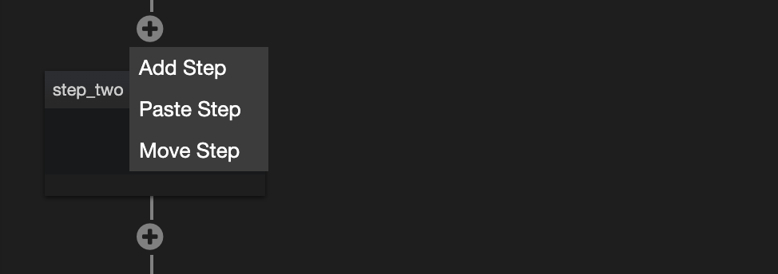

# Steps

## Understanding what a Step is

A Step is a composable Function that comes with a user interface that can customised to improve ease of use of setting up and comprehending that Function.

## Add a new Step to a Flow

While viewing a Flow, the **+** Button seen on the lines between steps indicates where you can add new Steps. When clicking on this, choose to **Add Step**. ****

This will bring up a dialog to enter in a name for your new Step. Once done you will be shown the Step Library with which you can select a specific Step type to add.

## The Step Library

This library has a way to browse (filterable using the tabs at the top left), or search with the Search bar on the top right.

Although not yet represented in the UI, Steps can be broadly categorised into one of the following three (or in various combination of the three).

- Reactions (primary)
- Transformation (supporting)
- Orchestration (supporting)

Knowing which Step to search for and make use of is an area in which we want to keep innovating and lowering the difficult of. So before diving into the various Steps that exist in the library currently, let’s first discuss them in general some more.

The categorisation above helps with that, especially since we have an idea of which is primary (Reactions), and which are supporting. If we can get a handle on what we are primarily trying to achieve, the supporting steps become easier to understand because we can see how they help the primary concern.

### Reactions (primary)

Reactions are easy to identify when modelled as a Role Reaction in Trixta. However, not everything is currently encapsulated conveniently in a Role! We have many Steps that cause Reactions that are not yet clearly indicated as such yet.

<aside>
💡 This is an area of work for us to make simple for you, our first step is to categorise which are which in the step library (ultimately, we would help by auto-encapsulating groups of corresponding Steps into sensible implicit Roles with Reactions).

</aside>

Instead we could sum up Steps that exhibit a Reaction-like behaviour as ones that communicate to anything outside of the Space, or anything that changes (or could possibly change) the state of something within. We say this is primary because Steps that do not communicate, or do not change state, don’t have any effect on the outside world, and so can’t be directly related to the primary purpose of the Space, which is always to have some sort of effect outside of it.

Let’s look as some examples of Steps that are currently in the library.

Steps that communicate to anything outside of the Space:

- Request for Response
- Request for Effect
- Send Mail
- Http Web Request
- Slack Post Message

Possibly change the state of something within:

- Write to Storage
- Remove from Storage

The next two types, Transformation and Orchestration are now easier to describe in the context of supporting one or many Reactions like those above.

### Transformation (supporting)

The following is a repeat of the diagram found in the Flows section, but now may make more sense here:

Here we can see how there are supporting steps represented in-between the Reactions.

Since Roles can be fulfilled by Agents that may be nothing alike, often the shape of the data we communicate to each is different, or a subset or combination of data is needed - in both cases we require transformation.

Steps that transform data include:

- Code step while using functions such as
    -

- Library step while using functions such as
    -

- …

### Orchestration (supporting)

The other type of supporting step that helps in-between Reactions are those that orchestrate. Often the flows you build will require a level of sophistication that includes timing, or conditionally choosing to do or not do a set of steps depending on the current situation. Steps that perform this type of function are categorised as Orchestration steps.

Steps that orchestrate include:

- Sequence
- Parallel
- Race
- …

## Remove a step

## Step search

## Copy or Move a step

- Notes about nested steps

## View Step Settings

### Settings tab

- Static
- Dynamic

### Input tab

### Branch tab

### Log tab

### Code tab

## Quirks
