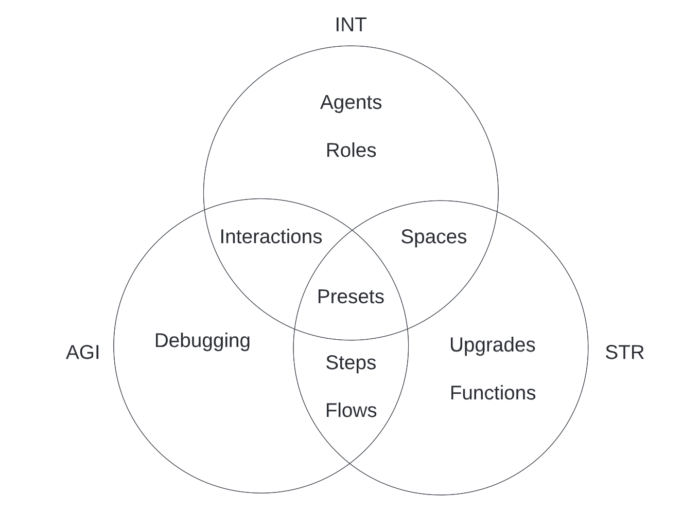

# Choose your starting style

Trixta can be approached from a few different perspectives. Which perspective to begin with has more to do with how you think about software. Fortunately, the IDE ensures that all the different personalities still work on the same solution and everything that is done is composable and interoperable across the team.

Here we divide these main approaches, or starting styles down into three. Choosing one to begin with will help lower the initial difficulty, and help you add value to a team more quickly. When comfortable with a style, move onto the next ones to become proficient across the board.

## Closer look at the three main styles

In role play gaming the following three major categories come up time and time again: INT (Intelligence), AGI (Agility), and STR (Strength). I wouldn’t worry too much about how well these match your personality, instead consider them just as a fun way to label the three styles we have broken the learning material down into.

The following table contains words and phrases that provide hints as to what each style is about. Take a look through them and see which resonates the most with you and begin down that path.

| INT | AGI | STR |
| --- | --- | --- |
| Product / Organisation Focus | Process Engineering | Software Engineering |
| Thinking about user experience | Plugging existing software together | New software from scratch |
| What to do | What and How to do | How to do |
| Interfacing | Transforming | Problem Solving |
| Delegating | Using the right tool | Finding / making the right tool |
| Bigger picture | Something in-between | Finer details |
| Directing | Sequencing / Orchestrating | Configuring |

<aside>
💡 Having any one of the above styles waxed, will lower the difficulty of learning the others because you will better understand the context in which you are doing something

</aside>

## How the styles relate to areas within Trixta

### INT

- Agents
- Presets
- Roles
- Interactions
- Spaces (Lite)

### AGI

- Interactions
- Debugging
- Presets
- Flows (Full)
- Steps

### STR

- Steps
- Flows (Lite)
- Presets
- Upgrades
- Functions
- Spaces (Full)

<aside>
💡 You’ll notice that some styles overlap. This is deliberate in that it helps team members of different styles have common ground in which their solutions will come together.

</aside>

## Continue down a path…

(If still unsure, start at the top with INT)

[INT](INT/index.md)

[AGI](AGI/index.md)

[STR](STR/index.md)

---

[Shared](Shared/index.md)
