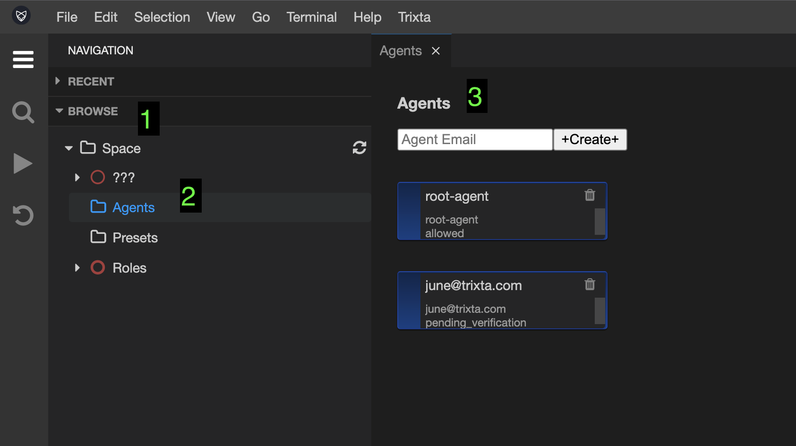

# Agents

## Understanding what an Agent is

In Trixta, your Space and everyone / everything involved is working towards a goal (or sometimes referred to as an intention). In most cases it’s not one simple thing, but rather a combination of things.

Whatever it is, it is more often than not achieved through the help of others and has an effect on them. We collectively call these others, Agents. Agents breathe life into your Space and can be people or entire systems.

<aside>
📕 **Agent** 
a person or thing that takes an active role or produces a specified effect.

</aside>

The purpose of an Agent is to fulfil one or many Roles in your Space.

In the next major section we will discuss the concept of Roles (and why they are not exactly the same as Agents), for now just keep in mind that Agents need to be assigned Roles before they can get involved with your Space in any meaningful way.

## Agents view

Using Navigation → Browse, look for Agents underneath Space. 

Selecting this will open up the Agents view which will list all the Agents you’ve added to your Space as well as provide options to Create new, Edit or Remove them.

## Create new Agent

To create a new Agent, enter in an Email address into the input box and hit Create.

Confirm the dialog if the email address is as you intended:

Your new Agent should appear in the View:

<aside>
💡 At this point the Agent will go into a “Pending Verification” status, which means an email will be sent to that address for the owner to return and enter in a password for themselves to complete the process.

We do this to ensure that the Agent is the owner of the email address and also to prevent us from ever knowing the Agents password (we instead save a salted hash)

3rd party Authentication is also possible, more on that later…

</aside>

## New Agent’s User Journey

Here is what a new Agent (who is a person with an email) would experience.

First, they will receive an email like so:

Clicking on the appropriate link should redirect them to the IDE with the appropriate Space specified, where a dialog to add a password should display. Once submitted the Agent should be able to access the IDE provided they have the `trixta_ide_user` Role (default).

## Login

Agents with the `trixta_ide_user` Role can access the IDE by browsing to it (See [Browse to the IDE](../../Getting%20started%20with%20Trixta.md)) and then entering in their email (identity) and password. 

Agents can also interact with a Space through API calls or through other clients, and (provided the Role they are assuming isn’t unrestricted) they will have to provide some sort of authentication.

<aside>
💡 Trixta Roles can be set up to have their own unique authentication processes associated with them. So although Trixta provides some built in defaults that work from the start, you can extend the capability to whatever suits the organisation or product.

</aside>

## Forgot Password

If you have forgotten your password, it is possible to reset it using a link found on the Login popup.

The forget password dialog should then appear, where you can add your email address to the box and submit it. That should trigger an email to your inbox with a link to return and reset your password.

## Remove Agent

Remove an Agent by clicking the trash can icon at the top right of the block.

## Edit an Agent

To Edit an Agent, click on it in the view and the Agent Settings panel should appear. All we are currently concerned with, is to assign Roles to the Agent. Newly added Agents are given the `trixta_ide_user` role by default. Let’s not worry about changing anything here just yet, just know that this is where you would change / add / remove roles from and Agent when needed.

## Agent Cheatsheet

Agents can be assigned to one or many Roles

- An Agent can perform more than one Role at the same time.
- E.g. Agent C here is set to perform both Role X and Y

Roles can be fulfilled by one or many Agents at the same time

- Role X is fulfilled by Agent A, B and C
- In this E.g. Role Y is only fulfilled by Agent C

The relationship between Roles and Agents is many-to-many.

Through this mechanism, we can focus on Roles in our design and less about individual Agents.

## Exercises

1. Gain Access to the IDE using your own Agent account
2. Create a new Agent for someone else to access the IDE
3. Add `everyone_authed` role access to your account

## Videos

Coming soon…